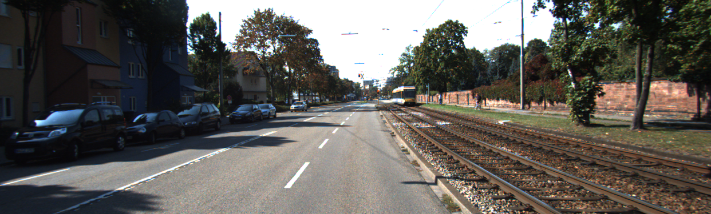
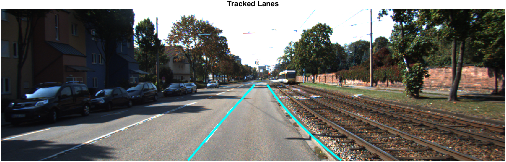

# Lane Detection Using Edge Detection and Hough Transform for Autonomous Vehicles


This project implements a lane detection algorithm using MATLAB, focusing on computer vision techniques such as edge detection, color segmentation, and the Hough Transform. Polynomial fitting is employed for accurate curved lane tracking, ensuring continuity and robustness. The algorithm is tested on the KITTI dataset and optimized for real-world scenarios with varied lighting and road conditions.

---

## **Features**
- Edge Detection (Canny) for identifying lane boundaries.
- HSV-based Color Segmentation for isolating lane markings.
- Region of Interest (ROI) masking for focused detection.
- Hough Transform for line detection and fitting.
- Polynomial Curve Fitting for precise curved lane tracking.
- Scalability enhancements for diverse environmental conditions.

---

## **Prerequisites**
1. **MATLAB** (Tested on R2024b) with:
   - Image Processing Toolbox
   - Computer Vision Toolbox
2. **KITTI Dataset**: [Download here](http://www.cvlibs.net/datasets/kitti/)
3. Basic understanding of MATLAB scripting.

---

## **Setup and Usage**

### 1. Clone the Repository
```bash
git clone https://github.com/Sudharsan0203/Lane-Detection-Using-Edge-Detection-and-Hough-Transform-for-Autonomous-Vehicles.git
cd Lane-Detection-Using-Edge-Detection-and-Hough-Transform-for-Autonomous-Vehicles
```

### 2. Organize the Dataset
Place the input images from the KITTI dataset in the `inputs` folder within the repository directory.

### 3. Run the Script
1. Open `lane_detection.m` in MATLAB.
2. Update the `inputFolder` and `outputFolder` variables with the correct paths to your input images and desired output directory.
3. Execute the script to process all images in the input folder.

### 4. View Results
Processed images with overlaid lane markings are saved in the output directory specified.

---

## **Folder Structure**
```
Lane-Detection-Using-Edge-Detection-and-Hough-Transform-for-Autonomous-Vehicles/
├── input_images/
│   ├── input_01.png
│   ├── input_02.png
│   ├── input_03.png
│   ├── input_04.png
│   ├── input_05.png
│   ├── input_06.png
│   ├── input_07.png
│   ├── input_08.png
│   ├── input_09.png
│   ├── input_10.png
├── output_images/
│   ├── output_01.png
│   ├── output_02.png
│   ├── output_03.png
│   ├── output_04.png
│   ├── output_05.png
│   ├── output_06.png
│   ├── output_07.png
│   ├── output_08.png
│   ├── output_09.png
│   ├── output_10.png
├── lane_detection.m
├── preprocess_image.m
├── README.md
├── LICENSE
├── requirements.txt
├── DATASET.md
├── .gitignore

```

---

## **Key MATLAB Functions Used**
- `imread`, `imshow`, `imwrite` for image handling.
- `rgb2gray`, `imgaussfilt`, `edge` for preprocessing and edge detection.
- `poly2mask` for ROI masking.
- `hough`, `houghpeaks`, `houghlines` for Hough Transform.
- `polyfit`, `polyval` for polynomial curve fitting.

---

## **Sample Input and Output**
The algorithm processes input images to detect lanes and overlays the detected lanes on the original image:

| Input Image               | Output Image              |
|---------------------------|---------------------------|
|  |  |

---

## **Future Enhancements**
- Integration with video data for real-time lane detection.
- Enhancement of robustness under extreme weather conditions.
- Addition of deep learning techniques for improved accuracy.

---

## **License**
This project is licensed under the [MIT License](LICENSE).

---

## **Contributions**
Contributions are welcome! Please create a pull request for any updates or improvements.

---

## **Contact**
For questions or collaborations, feel free to reach out:
- **Name**: Sudharsan N
- **Email**: [your.email@example.com](mailto:your.email@example.com)
- **LinkedIn**: [Your LinkedIn Profile](https://www.linkedin.com/in/your-profile)
